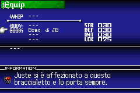
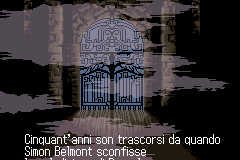

# Castlevania: Harmony of Dissonance - Italian translation

**English** | [Italiano](README.it.md)

Unofficial Italian translation patch for the USA version of *Castlevania:
Harmony of Dissonance* on Game Boy Advance.

The patch is compatible with **Visual Improvement V1.2.7** and is available in
four variants. The original game and the Visual Improvement patch are not
included.

## Download

Download the latest version from the
[Releases](https://github.com/Bruc3Dev573/castlevania-hod-ita/releases) page.

## Required base

- ROM: `Castlevania - Harmony of Dissonance (USA)`
- CRC32: `88C1B562`
- SHA-1: `B90DA0D9BE0B3A0893CD9E2C399056BCF9579E21`
- [Visual Improvement V1.2.7](https://www.romhacking.net/hacks/9086/)

## Installation

1. Start from a clean USA ROM with CRC32 `88C1B562`.
2. Apply the desired Visual Improvement V1.2.7 variant.
3. Apply the matching Italian patch to the already modified ROM.

| Visual Improvement variant | Italian patch |
|---|---|
| V1.2.7 original | `patches/hod-ita-vi-1.2.7.ips` |
| V1.2.7 C-Whip | `patches/hod-ita-vi-1.2.7-cwhip.ips` |
| V1.2.7 RMenu | `patches/hod-ita-vi-1.2.7-rmenu.ips` |
| V1.2.7 C-Whip RMenu | `patches/hod-ita-vi-1.2.7-cwhip-rmenu.ips` |

Do not apply the Italian patches directly to a clean ROM. Use
[Lunar IPS](https://fusoya.eludevisibility.org/lips/) or another IPS-compatible
patcher. Base and resulting hashes are listed in `release.json` and
`patches/manifest.json`. Technical details on the compatibility approach: see
[docs/how-it-works.md](docs/how-it-works.md).

## Version 1 status

The ROM has 717 text entries (dialogue, menus, item and enemy names). 613
are translated into Italian. The remaining 104 stay in English by design: 9
are character names (Maxim, Lydie, Dracula, and similar), 72 are short
item/enemy names that do not fit the fixed byte budget available for each
entry, and 23 are internal placeholder slots never shown in the game.

All four variants pass integrity checks, boot tests and focused
runtime checks covering menus, dialogue rendering and late-game story
progression. Saving and loading were also verified manually on hardware.

The game has been tested on real hardware for several hours, reaching
Castle B, with no crashes or softlocks. Castle B itself has not been
completed yet. The custom `ò` glyph may be hard to read in some text. A
fix is planned for a future release.

Report crashes, clipped text or other issues through
[Issues](https://github.com/Bruc3Dev573/castlevania-hod-ita/issues), including
the selected variant, patcher and location in the game.

## Screenshots

| Equip menu | Prologue |
|:---:|:---:|
|  |  |

## Credits

- Italian translation, adaptation and patch: **Bruc3Dev573**
- [Visual Improvement V1.2.7](https://www.romhacking.net/hacks/9086/):
  **sorrow, Piggy Chan!, ncoZ, spiffy, LagoLunatic**
- [French translation v0.7](https://traf.romhack.org/mavabxwa.html?p=patchs&pid=1608)
  by **Brutapode89**, used as a technical reference for the text and font
  structure

The Italian script was translated from the original English text. The French
translation is neither included nor layered into this patch.

Attribution and redistribution terms for original project material are in [`NOTICE`](NOTICE).

## Disclaimer

This is an unofficial project provided without warranty. Konami and the
credited authors are not involved. You must own a personal copy of the game.

This repository contains patches, checksums and documentation only. Rights
holders may request removal by opening an issue.
